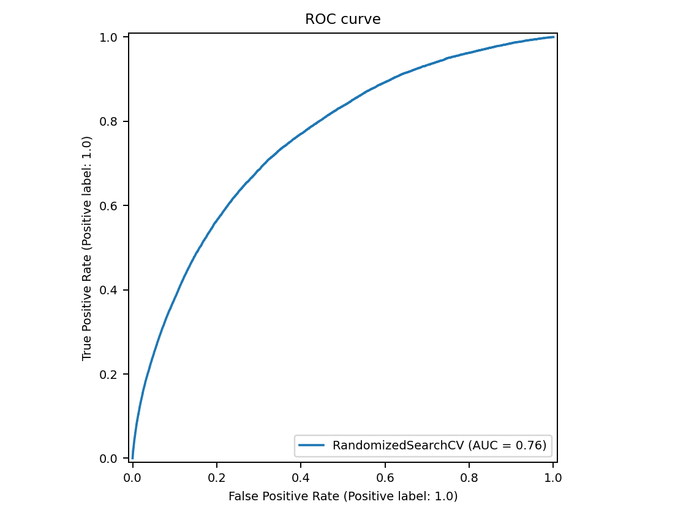
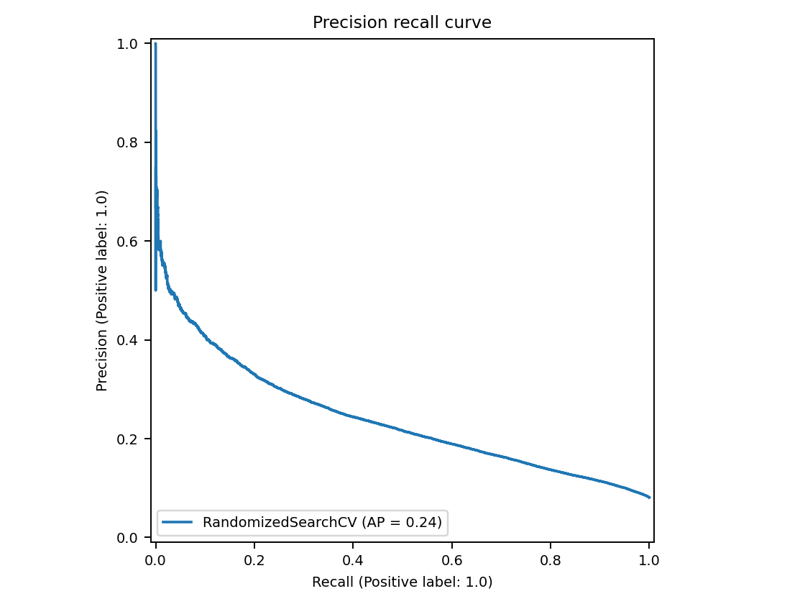
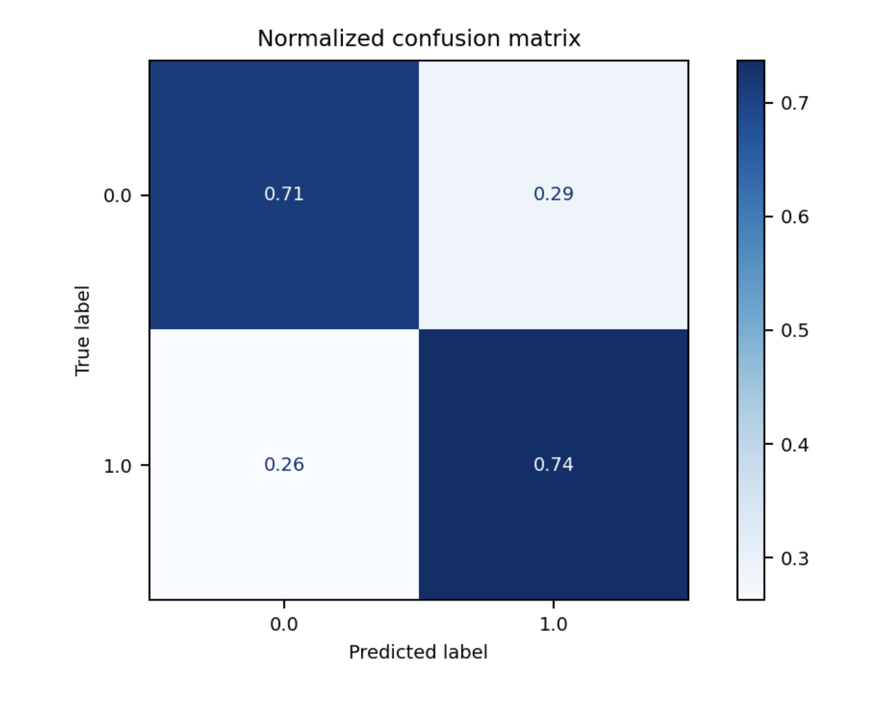
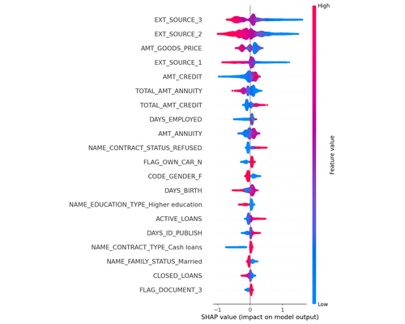
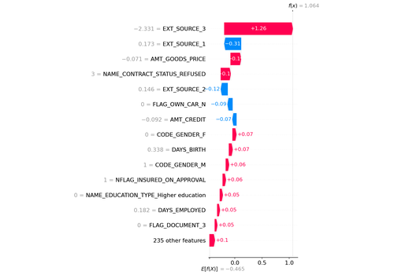
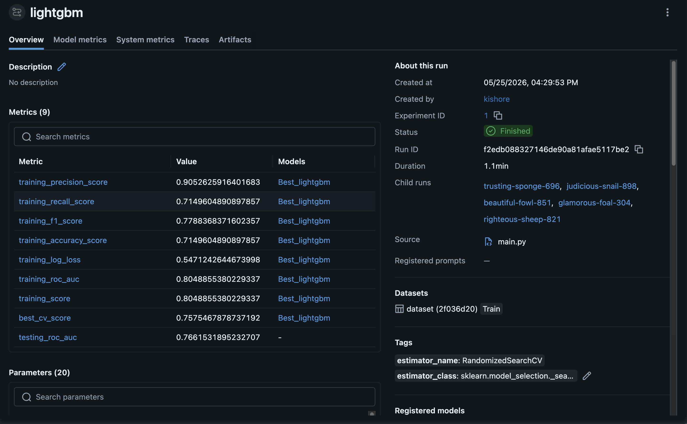
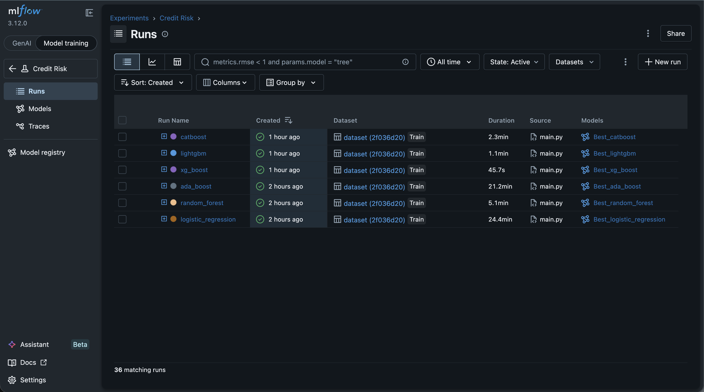

# Loan Default Risk Predictor

A machine learning project for predicting loan default risk using the Home Credit dataset with advanced feature engineering, hyperparameter optimization, and model comparison techniques.

## Table of Contents

- [Problem Statement](#problem-statement)
- [Dataset Overview](#dataset-overview)
- [Model Performance](#model-performance)
- [Feature Importance](#feature-importance)
- [Project Architecture](#project-architecture)
- [How to Run](#how-to-run)
- [Installation](#installation)
- [Results](#results)

---

## Problem Statement

**Predicting loan default is a critical business problem in the lending industry.** Financial institutions face significant losses due to loan defaults. The goal is to build a robust machine learning model that can:

- Accurately predict the probability of a loan applicant defaulting on their loan obligation
- Identify high-risk applicants before approval
- Understand key factors influencing default decisions through model interpretability
- Minimize false negatives (missed defaults) while maintaining reasonable false positive rates

### Target Variable

- **TARGET**: Binary classification (0 = No Default, 1 = Default)
- **Class Imbalance**: ~11.4% defaults (88.6% non-defaults)

### Business Impact

Accurate predictions enable:

- Risk-based lending decisions
- Optimized interest rates based on risk profiles
- Reduced portfolio losses
- Improved customer targeting for risk mitigation

---

## Dataset Overview

### Home Credit Dataset

The dataset comprises historical loan application and payment records from Home Credit Global Finance.

#### Data Files

| File                         | Records    | Description                                          |
| ---------------------------- | ---------- | ---------------------------------------------------- |
| **application_train.csv**    | 307,511    | Training data with target and applicant demographics |
| **application_test.csv**     | 48,744     | Test data for predictions                            |
| **bureau.csv**               | 1,716,428  | Historical credit bureau data                        |
| **bureau_balance.csv**       | 13,222,996 | Monthly payment status                               |
| **previous_application.csv** | 1,670,214  | Previous credit applications                         |

#### Key Statistics

- **Training Samples**: 307,511 applications
- **Test Samples**: 48,744 applications
- **Default Rate**: ~11.4%
- **Original Features**: 122
- **Engineered Features**: 40+

### Feature Engineering

The project aggregates features from 3 related tables:

**From Bureau & Bureau Balance:**

- Active/Closed loan counts
- Average credit amounts
- Payment status frequency
- Total months balance

**From Previous Applications:**

- Previous application counts
- Approval/Rejection rates
- Total annuity, credit, goods price
- Last application flags

---

## Model Performance

### Model Comparison (ROC-AUC Score)

| Model               | ROC-AUC Score |
| ------------------- | ------------- |
| **LightGBM**        | **0.7662** ⭐ |
| XGBoost             | 0.7636        |
| CatBoost            | 0.7623        |
| Logistic Regression | 0.7519        |
| AdaBoost            | 0.7519        |
| Random Forest       | 0.7381        |

**Best Model: LightGBM** - Achieves the highest validation ROC-AUC score of 0.7662

### Model Evaluation Visualizations

#### ROC Curve



The ROC curve shows the trade-off between True Positive Rate and False Positive Rate across different classification thresholds. LightGBM demonstrates superior performance.

#### Precision-Recall Curve



The Precision-Recall curve illustrates the balance between precision and recall, critical for imbalanced datasets where defaults are rare.

#### Confusion Matrix - LightGBM



The confusion matrix shows the distribution of True Positives, True Negatives, False Positives, and False Negatives for the best model.

---

## Feature Importance

### SHAP Summary Plot



The SHAP summary plot reveals the most influential features for predictions:
- Shows how each feature pushes the model output from the base value
- Larger impact values indicate more important features
- Color intensity represents feature value (red = high, blue = low)

### SHAP Waterfall Plot



The waterfall plot breaks down a single prediction, showing:
- Base model output (expected value)
- Contribution of each feature to push prediction up or down
- Final prediction probability

---

## Project Architecture

### Data Pipeline

```
Raw Data (5 CSVs)
    ↓
Data Ingestion & Feature Engineering
    ├── Bureau Feature Aggregation
    ├── Bureau Balance Aggregation
    └── Previous Application Aggregation
    ↓
Feature Merging & Combination
    ↓
Train/Valid/Test Split (80/20)
    ↓
Data Transformation
    ├── Missing Value Handling
    ├── Outlier Detection
    └── Feature Scaling
    ↓
Model Training Pipeline
    ├── Logistic Regression
    ├── Random Forest
    ├── AdaBoost
    ├── XGBoost
    ├── LightGBM
    └── CatBoost
    ↓
Hyperparameter Optimization (RandomizedSearchCV)
    ↓
Model Evaluation & Selection
    ↓
SHAP Explainability Analysis
    ↓
Production Artifacts
```

---

## How to Run

### 1. Install Dependencies

```bash
pip install -r requirements.txt
```

### 2. Download Dataset

Download from [Kaggle Home Credit](https://www.kaggle.com/competitions/home-credit-default-risk/data) and extract to `dataset/` directory.

### 3. Run the Pipeline

```bash
python main.py
```

### 4. View Results

- **Model comparison**: `artifact/table.parquet`
- **Best model**: `models/model.pkl`
- **Predictions**: `artifact/predictions.parquet`
- **SHAP plots**: `artifact/shap_*.png`

### 5. Monitor with MLflow (Optional)

```bash
# Terminal 1: Start MLflow server
mlflow ui --backend-store-uri sqlite:///mlflow.db

# Terminal 2: Run pipeline
python main.py

# Access MLflow at http://localhost:5000
```

#### MLflow Dashboard



MLflow tracks all model training experiments including metrics, parameters, and artifacts.



View detailed run information and compare model performance across experiments.

---

## Installation

### Prerequisites

- Python 3.12+
- pip or uv

### Step-by-Step Setup

1. **Clone Repository**

```bash
git clone https://github.com/a-kishore-dev/Loan-Default-Risk-Prediction
cd Loan_Default_Risk_Predictor
```

2. **Create Virtual Environment**

```bash
python3.12 -m venv venv
source venv/bin/activate  # On Windows: venv\Scripts\activate
```

3. **Install Requirements**

```bash
pip install -r requirements.txt
```

4. **Verify Installation**

```bash
python -c "import polars; import xgboost; import lightgbm; print('✓ All dependencies installed')"
```

---

## Project Structure

```
Loan_Default_Risk_Predictor/
├── README.md                          # Project documentation
├── requirements.txt                   # Python dependencies
├── main.py                            # Main pipeline execution
│
├── dataset/                           # Raw data (from Kaggle)
│   ├── application_train.csv
│   ├── application_test.csv
│   ├── bureau.csv
│   ├── bureau_balance.csv
│   └── previous_application.csv
│
├── artifact/                          # Generated artifacts
│   ├── train.parquet                  # Processed training data
│   ├── valid.parquet                  # Validation data
│   ├── test.parquet                   # Test data
│   ├── table.parquet                  # Model comparison results
│   ├── predictions.parquet            # Final predictions
│   ├── shap_summary_plot.png          # Feature importance
│   └── shap_waterfall_plot.png        # Prediction breakdown
│
├── models/                            # Trained models
│   └── model.pkl                      # Best model (LightGBM)
│
├── images/                            # Evaluation visualizations
│   ├── roc_curve.png
│   ├── precision_recall_curve.png
│   ├── confusion_matrix_lightgbm.png
│   ├── ml_runs_dashboard.png
│   └── mlflow_metrics.png
│
├── src/                               # Source code
│   └── features/
│       ├── data_ingestion.py          # Load & aggregate data
│       ├── data_transformation.py     # Preprocessing & scaling
│       ├── model_training.py          # Model training & eval
│       └── utils.py                   # Helper functions
│
├── notebooks/                         # Jupyter notebooks
│   └── EDA.ipynb                      # Exploratory analysis
│
└── mlflow.db                          # MLflow tracking database
```

---

## Results

### Key Findings

1. **LightGBM is the best performer** with ROC-AUC of 0.7662
2. **Gradient Boosting models outperform** linear and ensemble methods
3. **Feature engineering significantly improves** model performance
4. **Class imbalance handling** with `scale_pos_weight` is essential
5. **SHAP analysis reveals** income, age, and credit history as top predictors

### Model Comparison Details

| Model         | Train ROC | Valid ROC  | Train F1 | Valid F1 |
| ------------- | --------- | ---------- | -------- | -------- |
| LightGBM      | 0.8049    | **0.7662** | 0.2948   | 0.2709   |
| XGBoost       | 0.7940    | 0.7636     | 0.2910   | 0.2714   |
| CatBoost      | 0.7696    | 0.7623     | 0.2749   | 0.2661   |
| Logistic Reg  | 0.7550    | 0.7519     | 0.2655   | 0.2619   |
| AdaBoost      | 0.7536    | 0.7519     | 0.0173   | 0.0171   |
| Random Forest | 0.8100    | 0.7381     | 0.3113   | 0.2651   |

---

## Dependencies

### Core ML Libraries

- `scikit-learn>=1.8.0` - ML algorithms & preprocessing
- `polars>=1.41.0` - Fast DataFrame operations
- `xgboost>=3.2.0` - Gradient boosting
- `lightgbm>=4.6.0` - Fast gradient boosting (Best Model)
- `catboost>=1.2.10` - Categorical feature handling

### Supporting Libraries

- `mlflow>=3.12.0` - Experiment tracking
- `shap>=0.51.0` - Model explainability
- `matplotlib` - Visualization
- `numpy` - Numerical computations

---

## Troubleshooting

| Issue                   | Solution                                                          |
| ----------------------- | ----------------------------------------------------------------- |
| Module not found        | Run `pip install -r requirements.txt`                             |
| Dataset missing         | Download from Kaggle, extract to `dataset/`                       |
| MLflow connection error | Start MLflow: `mlflow ui --backend-store-uri sqlite:///mlflow.db` |
| Out of memory           | Reduce batch size or use streaming                                |

---

## Future Enhancements

- [ ] Ensemble stacking with multiple base models
- [ ] Feature selection optimization
- [ ] Real-time API deployment
- [ ] Model monitoring & drift detection
- [ ] AutoML integration
- [ ] A/B testing framework
- [ ] Cost-sensitive learning implementation

---

## License

This project is licensed under the MIT License.

---

## References

- [Home Credit Default Risk Competition](https://www.kaggle.com/competitions/home-credit-default-risk)
- [LightGBM Documentation](https://lightgbm.readthedocs.io/)
- [SHAP Documentation](https://shap.readthedocs.io/)
- [MLflow Documentation](https://mlflow.org/)
- [Polars Documentation](https://docs.pola-rs.com/)

---

**Last Updated**: May 25, 2026
